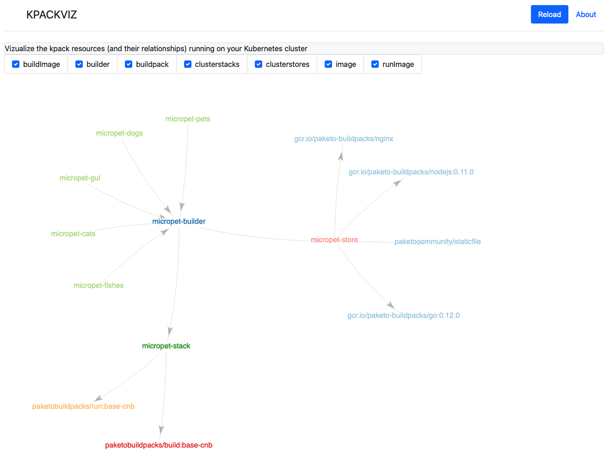

# KPack Viz

This project offers a graphical user interface allowing to display the CRD Resources and their relationships managed by the [kpack Project](https://github.com/pivotal/kpack) defined in a Kubernetes cluster 
* image
* builder
* clusterstack
* clusterstore
* clusterbuilder
* buildpacks.



## Running the app

### Java

````
git clone <repo>
mvn spring-booot:run
````
note: 
* requires Java 17+
* Use the `KUBECONFIG` environmnet variable

### Docker

````
docker run -p 8080:8080 -e KUBECONFIG=/.kube/config -v <path/to/your/kubeconfig/file.yml>:/.kube/config ghcr.io/bmoussaud/kpack-viz
````

### Kubernetes


## Dependencies:

* Bootstrap
* https://github.com/vasturiano/force-graph
* Spring Boot